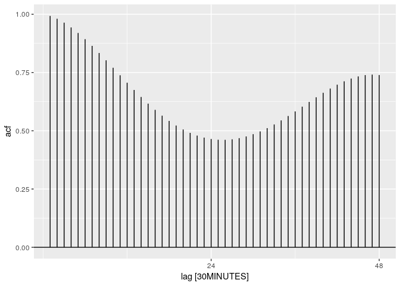

<!-- README.md is generated from README.Rmd. Please edit that file -->
tsibblestats
============

[](https://travis-ci.org/tidyverts/tsibblestats)

tsibblestats provides example datasets for use with the tidyverts family of packages.

Installation
------------

You can install the development version from [GitHub](https://github.com/) with:

``` r
# install.packages("devtools")
devtools::install_github("tidyverts/tsibblestats")
```

Example
-------

``` r
library(tsibblestats)
library(tsibbledata)
#> Loading required package: tsibble
#> 
#> Attaching package: 'tsibble'
#> The following object is masked from 'package:stats':
#> 
#>     filter
elecdemand %>% 
  ACF(Temperature, lag.max=48) %>%
  autoplot
```


