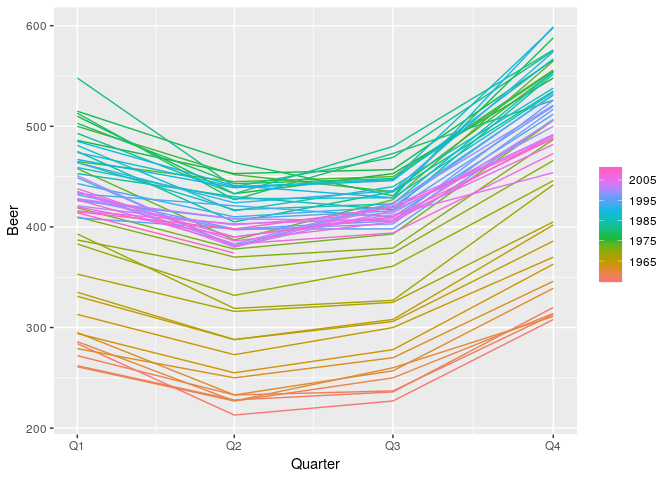
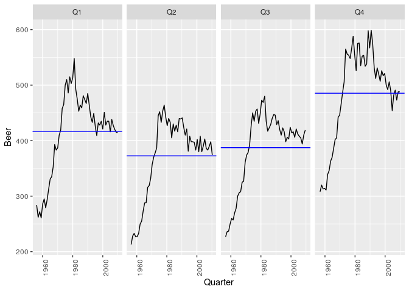
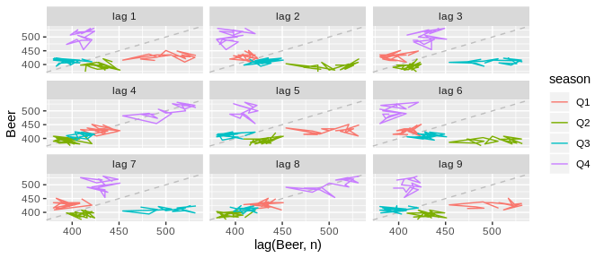
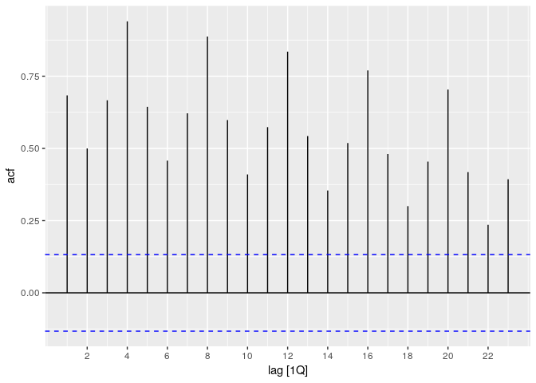
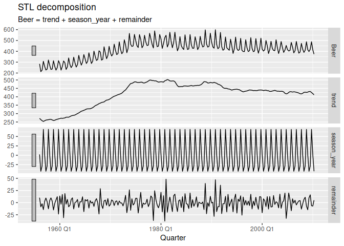
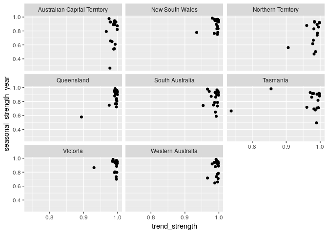

<!-- README.md is generated from README.Rmd. Please edit that file -->

# feasts <a href='https://feasts.tidyverts.org'></a>

[](https://travis-ci.org/tidyverts/feasts)
[](https://ci.appveyor.com/project/tidyverts/feasts)
[](https://codecov.io/gh/tidyverts/feasts?branch=master)
[](https://cran.r-project.org/package=feasts)
[](https://www.tidyverse.org/lifecycle/#experimental)

## Overview

feasts provides a collection of tools for the analysis of time series
data. The package name is an acronym comprising of its key features:
*Feature Extraction And Statistics for Time Series*.

The package works with tidy temporal data provided by the
[tsibble](https://github.com/tidyverts/tsibble) package to produce time
series features, decompositions, statistical summaries and convenient
visualisations. These features are useful in understanding the behaviour
of time series data, and closely integrates with the tidy forecasting
workflow used in the [fable](https://github.com/tidyverts/fable)
package.

## Installation

You could install the **stable** version from
[CRAN](https://cran.r-project.org/package=feasts):

``` r
install.packages("feasts")
```

You can install the **development** version from
[GitHub](https://github.com/tidyverts/feasts) with:

``` r
# install.packages("remotes")
remotes::install_github("tidyverts/feasts")
```

## Usage

``` r
library(feasts)
library(tsibbledata)
library(dplyr)
library(ggplot2)
library(lubridate)
```

### Graphics

Visualisation is often the first step in understanding the patterns in
time series data. The package uses
[ggplot2](https://github.com/tidyverse/ggplot2) to produce customisable
graphics to visualise time series patterns.

``` r
aus_production %>% gg_season(Beer)
```



``` r
aus_production %>% gg_subseries(Beer)
```



``` r
aus_production %>% filter(year(Quarter) > 1991) %>% gg_lag(Beer)
```



``` r
aus_production %>% ACF(Beer) %>% autoplot()
```



### Decompositions

A common task in time series analysis is decomposing a time series into
some simpler components. The feasts package supports two common time
series decomposition methods:

  - Classical decomposition
  - STL decomposition

<!--
* X11 decomposition
* X-13ARIMA-SEATS decomposition
-->

``` r
aus_production %>% STL(Beer ~ season(window = Inf))
#> # A dable:           218 x 6 [1Q]
#> # STL Decomposition: Beer = trend + season_year + remainder
#>    Quarter  Beer trend season_year remainder season_adjust
#>      <qtr> <dbl> <dbl>       <dbl>     <dbl>         <dbl>
#>  1 1956 Q1   284  272.        2.14     10.1           282.
#>  2 1956 Q2   213  264.      -42.6      -8.56          256.
#>  3 1956 Q3   227  258.      -28.5      -2.34          255.
#>  4 1956 Q4   308  253.       69.0     -14.4           239.
#>  5 1957 Q1   262  257.        2.14      2.55          260.
#>  6 1957 Q2   228  261.      -42.6       9.47          271.
#>  7 1957 Q3   236  263.      -28.5       1.80          264.
#>  8 1957 Q4   320  264.       69.0     -12.7           251.
#>  9 1958 Q1   272  266.        2.14      4.32          270.
#> 10 1958 Q2   233  266.      -42.6       9.72          276.
#> # … with 208 more rows
```

``` r
aus_production %>% STL(Beer ~ season(window = Inf)) %>% autoplot()
```



### Feature extraction and statistics

Extract features and statistics across a large collection of time series
to identify unusual/extreme time series, or find clusters of similar
behaviour.

``` r
aus_retail %>%
  features(Turnover, feat_stl)
#> # A tibble: 152 x 9
#>    State Industry trend_strength seasonal_streng… spikiness linearity curvature seasonal_peak_y…
#>    <chr> <chr>             <dbl>            <dbl>     <dbl>     <dbl>     <dbl>            <dbl>
#>  1 Aust… Cafes, …          0.989            0.537   6.15e-5     227.      48.6                 0
#>  2 Aust… Cafes, …          0.993            0.610   1.12e-4     342.      77.9                 0
#>  3 Aust… Clothin…          0.990            0.918   4.77e-6     131.      17.4                 9
#>  4 Aust… Clothin…          0.992            0.952   2.06e-5     195.      19.4                 9
#>  5 Aust… Departm…          0.975            0.977   2.79e-5     130.     -43.9                 9
#>  6 Aust… Electri…          0.991            0.929   3.03e-5     233.      -9.08                9
#>  7 Aust… Food re…          0.999            0.882   2.74e-4    1264.     199.                  9
#>  8 Aust… Footwea…          0.980            0.937   5.54e-6      64.0      1.98                9
#>  9 Aust… Furnitu…          0.980            0.669   4.66e-5     141.     -21.6                 9
#> 10 Aust… Hardwar…          0.992            0.895   1.47e-5     173.      45.2                 9
#> # … with 142 more rows, and 1 more variable: seasonal_trough_year <dbl>
```

This allows you to visualise the behaviour of many time series (where
the plotting methods above would show too much information).

``` r
aus_retail %>%
  features(Turnover, feat_stl) %>%
  ggplot(aes(x = trend_strength, y = seasonal_strength_year)) +
  geom_point() +
  facet_wrap(vars(State))
```



Most of Australian’s retail industries are highly trended and seasonal
for all states.

It’s also easy to extract the most (and least) seasonal time series.

``` r
extreme_seasonalities <- aus_retail %>%
  features(Turnover, feat_stl) %>%
  filter(seasonal_strength_year %in% range(seasonal_strength_year))
aus_retail %>%
  right_join(extreme_seasonalities, by = c("State", "Industry")) %>%
  ggplot(aes(x = Month, y = Turnover)) +
  geom_line() +
  facet_grid(vars(State, Industry, scales::percent(seasonal_strength_year)),
             scales = "free_y")
```


